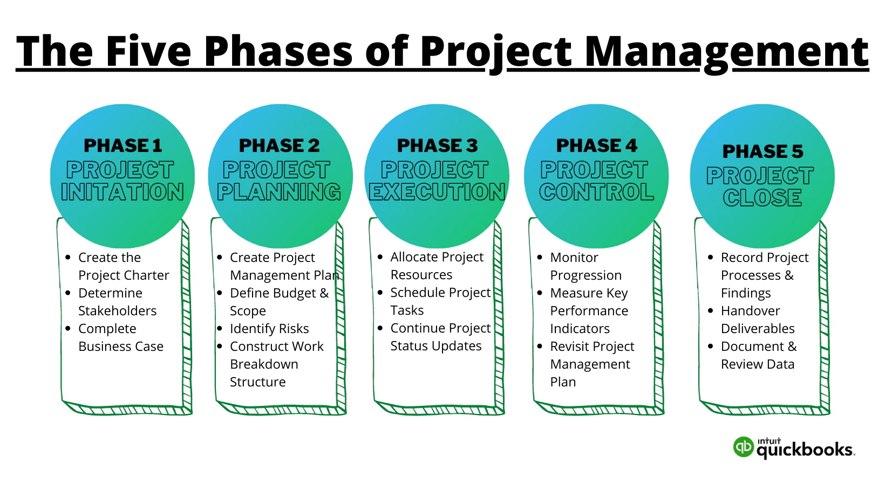

# PMP Terminology
> RTM (Requirement Traceability Matrix) - https://youtu.be/Kz6LNepwJ4c
* Matrix or Document to trace the requirements
> WBS (Work Breakdown Structure) - https://youtu.be/akO2Lf1fHmM
* Breaking Work into a Structure (articulate scope in a highly structured way)
* Numbering and Subnumbering is being used in the WBS Hierarchy
* Uses Network Chart and Gnatt Chart to describe WBS
* WBS can be done in Microsoft Project - where each task should be MECE (Mutually Exclusive and Completely Exhaustive)
> PM Phases - IPECC

